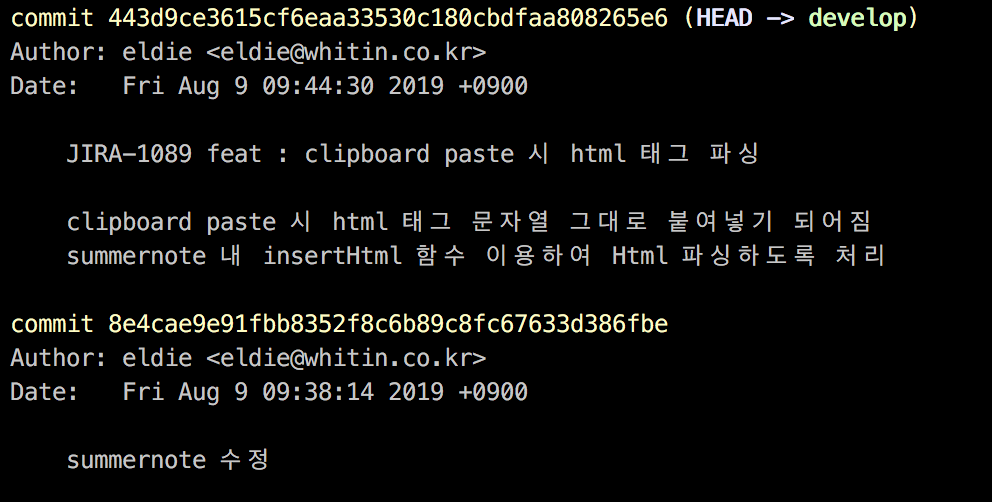

# Commit Message Guide

Created: Oct 30, 2019 10:29 AM
Created By: 동권 이
Last Edited By: 동권 이
Last Edited Time: Oct 30, 2019 10:33 AM
Type: Architecture Overview

### Basic

- commit 은 실행가능한 의미있는 단위로 작게 작성한다.

### 목적

- 코드 리뷰 시 커밋 메시지 만으로도 해당 PR 또는 커밋의 내용을 더 잘 파악하기 위함.
- 미래에 코드 커밋 히스토리를 봤을때, 어떠한 이유로 변경 했는지 확인하기 위함.sample >

### Guide

1. 되도록 지라 커밋이 없는 경우 발행후 작성하기 (push 되지 않은 local 커밋은 쉽게 커밋 메시지 변경이 가능합니다.)
2. 제목은 69자 이내로 작성하기 → "[지라티켓] [변경유형] : [제목]"
3. 제목 끝에 . 쓰지 않기
4. "-니다"로 끝내지 않기
5. 한글로 작성하기
6. 제목과 본문을 한 줄 띄워 분리하기 (git cli)
7. 본문은 72자 마다 줄 바꾸기
8. 본문은 어떻게보다 무엇을, 왜에 맞춰서 작성하기
9. 급한 경우 지라티켓을 공백으로 비우기
10. 지라 메인 티켓에서 서브태스크로 여러개 티벳이 발행된 이슈일 경우, 브랜치는 메인 지라티켓으로 만들되, 커밋 로그는 서브 태스트 지라티켓으로 히스토리를 관리

### 유형

- feat (feature)
- fix (bug fix)
- docs (documentation)
- style (formatting, missing semi colons, ...)
- refactortest (when adding missing tests)
- migration (DB migration)
- chore (maintain, comment edit, ... 이 유형은 다른 유형과 겹치기 쉽습니다. 다른 유형에 해당되는것 같으면 다른 유형을 지정합니다.)

### 커밋 메시지에 지라티켓번호 넣는 git hook 스크립트추가

    cat << 'EOF' > .git/hooks/commit-msg
    #!/bin/sh
    # Add git branch if relevant
    parse_git_branch() {
      git branch 2> /dev/null | sed -e '/^[^*]/d' -e 's/* \(.*\)/(\1)/'
    }
    # Extact tracker abbreviation and ticket number (e.g. XX-123)
    parse_git_tracker_and_ticket() {
      parse_git_branch | grep -e '[A-Z]\+-[0-9]\+' -o
    }
    MESSAGE="$(cat $1)"
    TICKET=`parse_git_tracker_and_ticket`
    INPUT_FILE=$1
    START_LINE=`head -n1 $INPUT_FILE`
    if [ -n "$TICKET" ]
    then
      if [[ $START_LINE == *"$TICKET"* ]]; then
       echo "$START_LINE" > $1
      else 
       echo "$TICKET $MESSAGE" > $1
      fi
    fi
    EOF
    chmod +x .git/hooks/commit-msg

### 참고

- [https://meetup.toast.com/posts/106](https://meetup.toast.com/posts/106)
- [https://gist.github.com/stephenparish/9941e89d80e2bc58a153](https://gist.github.com/stephenparish/9941e89d80e2bc58a153)
